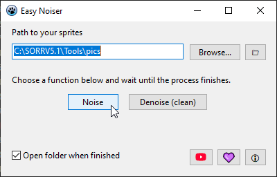

Before using the program, it is important that you read this entire content.

DEFINITION

Easy Noiser is essentially a graphical user interface (GUI) for the popular tool Noiser, which is used to apply effects to images so they can be correctly loaded in the game. The program also uses VampConvert to apply vertical inversion to images and a component to change the DPI of images.

At this moment, the project is new and may undergo significant changes in future versions.

If you have any suggestions or even find a bug, you can report it by sending me a private message on my Sorrforumotion profile (daniel2221), or in the posted topic.

INDEXED COLORS

The tool works only with images that contain indexed color tables (palettes). This technology limits the number of colors an image can have, making it useful for generating lighter and faster images. It also allows color swaps during a game. This is not only present in SorR but also in other popular game software, such as OpenBOR and Mugen.

There are software programs that allow you to prepare images with indexed palettes. Here are some well-known options:

* Fighter Factory
* IrfanView
* Photoshop

USING EASY NOISER

First of all, every image must have a name that starts with a number (examples: "1.bmp", "03.bmp", "41_attack.bmp"); otherwise, the process will fail.

With Easy Noiser openned, select a folder for your sprites and choose one of the two processes: Noise or Denoise.

After you click, the image processing will start immediately, and a console window will appear.

The process will finish when the console window closes. It can take a while depending how many images are in the folder.

THIRD PARTY APPLICATIONS

* FreeImage: an Open Source library project for developers who would like to support popular graphics image formats, licensed under the FIPL license.
* Lazarus IDE: A desktop environment for Object Pascal, in which Easy Noiser was developed, licensed under the LGPL.
* FreePascal: Object Pascal compiler used to make Easy Noiser, also licensed under a modified Library GNU Public License.
* Noiser: a command-line tool used to apply or withdraw noise effect in images.

TERMS OF USE

Using this application indicates you accept the terms of this license agreement and warranty. Disclaimer of warranty:

'Easy Noiser' is provided "as-is" and without warranty of any kind, express, implied or otherwise, including without limitation, any warranty of merchantability or fitness for a particular purpose. In no event shall the author of this software be held liable for data loss, damages, loss of profits or any other kind of loss while using or misusing this software.